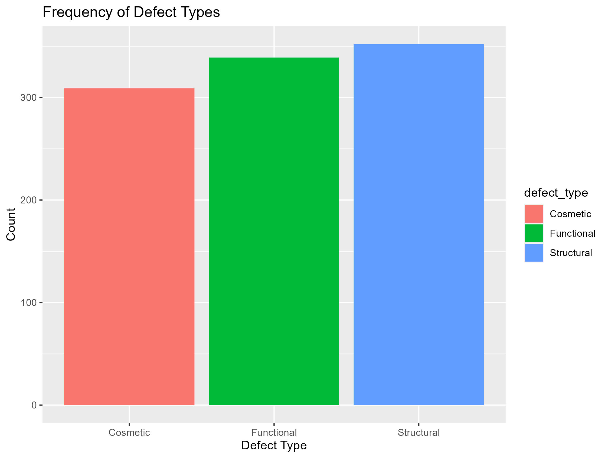
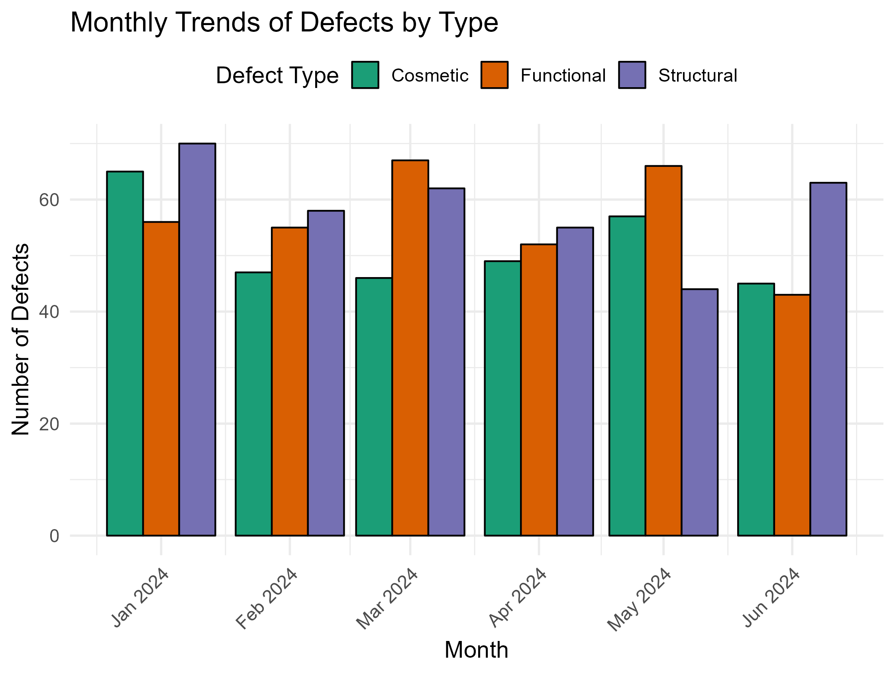
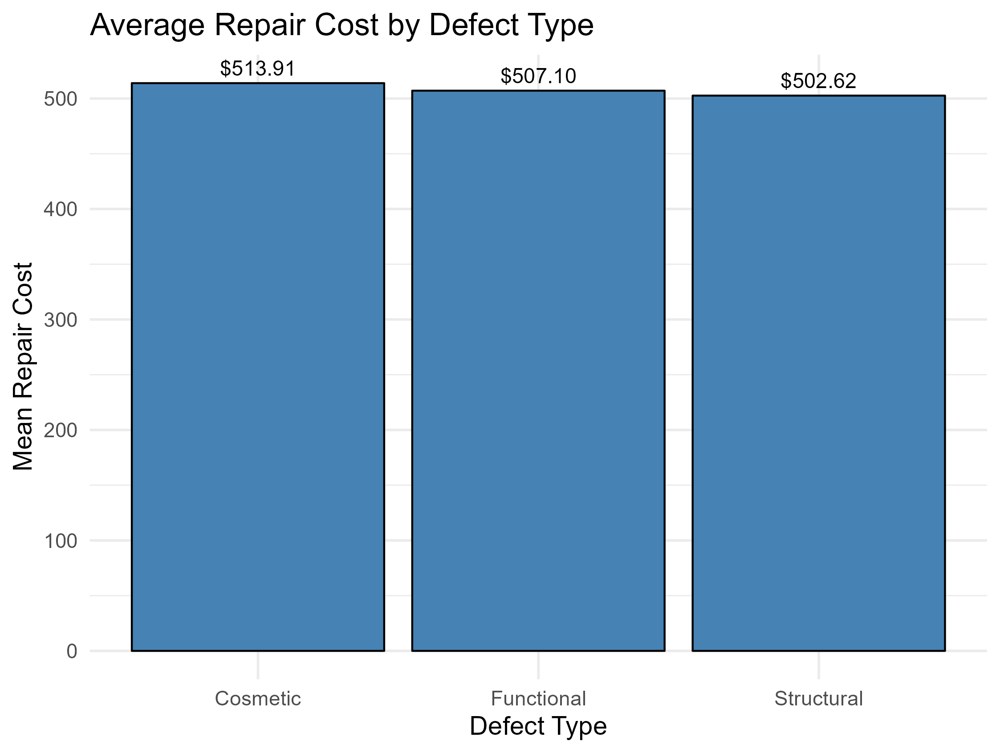
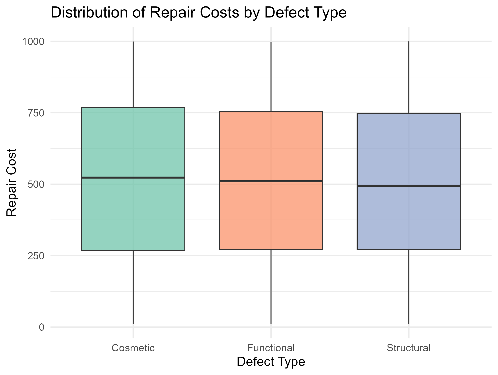
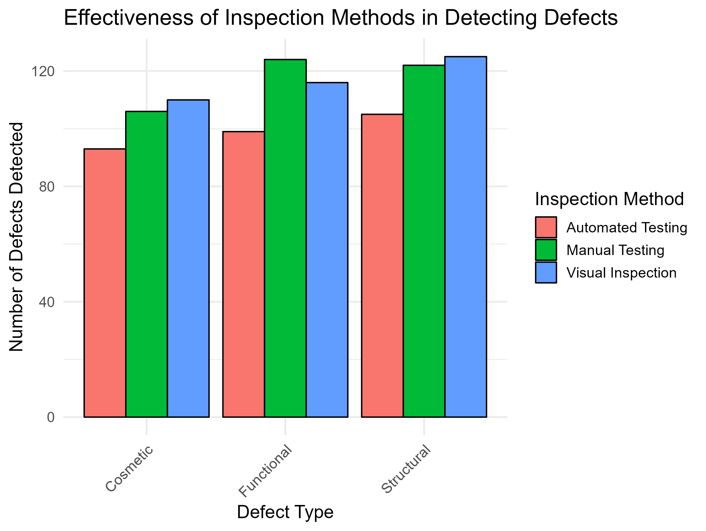

------THIS README IS UNDER CONSTRUCTION-------


# manufacturing-defects-analysis
Analysis of manufacturing defects using R to explore defect types, trends, and costs. Aims to enhance quality control processes through detailed data visualization and trend analysis.


## Data Source

### Dataset Overview
The dataset for this project was sourced from [Kaggle](https://www.kaggle.com), a platform hosting a variety of community-contributed datasets. This particular dataset focuses on manufacturing defects observed during quality control processes.

### Details
- **Title**: Manufacturing Defects
- **Contributor**: Fahmida Chowdhury
- **Accessed**: [February 16, 2025]
- **Direct Link**: [Manufacturing Defects Dataset](https://www.kaggle.com/datasets/fahmidachowdhury/manufacturing-defects)

### Content
The dataset includes comprehensive details on various types of manufacturing defects such as defect type, detection date, product location, severity, inspection method used, and repair costs. These data points are crucial for analyzing defect patterns and improving quality control measures within manufacturing processes.

### Usage
This dataset is utilized in this project to analyze defect patterns, examine trends over time, and assess the effectiveness of different inspection methods. The insights derived are aimed at enhancing the quality control processes in manufacturing.

### License
For details on the dataset's usage rights and licensing, please refer to the [Kaggle dataset page](https://www.kaggle.com/datasets/fahmidachowdhury/manufacturing-defects).

## Data Cleaning
### Overview
This section outlines the procedures followed to clean and preprocess the dataset, ensuring the data is accurate, complete, and appropriate for analysis.

### Steps Involved

1. **Loading the Data**:
   - The raw data is loaded into R using the `read_csv()` function from the `readr` package, part of the `tidyverse`.

2. **Handling Missing Values**:
   - Missing values were checked and handled appropriately. Depending on their significance and the potential impact on analysis, missing values were either imputed or rows containing them were removed.

3. **Date Formatting**:
   - The `defect_date` column was converted from a string to a Date object to facilitate time-series analysis. This was accomplished using the `as.Date()` function, with the date format specified to match the dataset.

### Script Location
- The script for data cleaning can be found in the repository at: `scripts/01_data_cleaning.R`

### Additional Notes
- It is recommended to verify the processed data file to ensure all cleaning steps have been properly applied before proceeding to the analysis phase.
- Details on how to run the cleaning script and the required packages are documented within the script comments for ease of use.

## Manufacturing Defects Analysis
### Overview
Ok, let's go for the interesting part.
If you got here through my LinkedIn profile, you have noticed that I am a Production Engineer. So I took this project to show my analytical skills in a field related to my engineering: manufacturing and quality control.

This project will be focusing on (using R):
- **Defect frequency trends** over time.
- **Defect-location relationships** within the product.
- **Repair cost distributions** and anomaly detection.
- **Inspection method effectiveness** in detecting defects.
- **Severity vs. repair cost correlation** to find inefficiencies.

The analyses help identify **potential quality control issues** and **optimize repair cost allocation**.
**NOTE:** The script where all of these findings were obtained is [`02_EDA.R`](scripts/02_EDA.R)  

## 🚀 **Key Analyses & Findings**

### **1. Most Common Defects**
#### **Question** What are the most frequent defect types?  


#### **Insights**
- All three defect types have **similar frequencies**, between 300-350 defects each.
- **"Structural"** defects are the **most common**, slightly higher than "Functional" defects.
- **"Cosmetic"** defects are the **least frequent**, but **still significant** due to the similar frequencies.
#### **Interpretation**
- Since all defect types appear at similar frequencies, quality issues are not isolated to a single defect category.
- The high frequency of "Structural" defects might indicate production weaknesses in assembly or material durability, even in the performance of the product for its use. Affecting straight to the consumer satisfaction of purchase and reputation of the brand.
- Cosmetic defects, while slightly lower, still occur frequently, suggesting aesthetic quality control issues.
- Functional defects, being the second most common, may require further investigation into design or performance-related failures.

### **2. Defect Trends Over Time**
#### **Question** How do defects vary over time (monthly)? 

Since we have data for the first six months of the 2024, it is easier to compare by month. Otherwise could lead to a messy plots



**OVERALL TREND**
- No clear increasing or decreasing trend—defects fluctuate month to month.
- Cosmetic defects are most stable, while Functional and Structural defects vary more.

#### **Insights**
##### Structural Defects Are Generally High
- **January, February, March, and June**: Structural defects are the highest among all categories.
- **May 2024** is an exception, where Structural defects are the lowest.
##### Functional Defects Spike in March and May
- **March and May** show noticeable increases in Functional defects compared to other months.
- This might indicate **process failures or design flaws** in those periods.
##### Cosmetic Defects Are More Consistent
- **Cosmetic defects remain relatively stable**, with no major spikes or dips.
- **Small increase in May**, but overall, Cosmetic defects fluctuate less than Functional or Structural defects.
##### Drop in Structural Defects in May
- **May 2024** shows a sudden drop in Structural defects while Functional defects peak. (Could be due to improvements in structural integrity or a shift in defect categorization?)


#### **Interpretation**
- Changes in materials or assembly processes?
- New product models introduced?
- Environmental factors (seasonal variations in manufacturing)?
- Was there an improvement in design or quality control?
- Did inspection methods change, reducing recorded Structural defects?
- Could Structural defects have been misclassified as Functional?

Things as looking for documentation related to the control process from those months, such as control charts as an example, could lead to a clue to find that root-cause.

### **3. Defect Trends Over Time**
#### **Question** Are defect types correlated with specific locations?
#### **Correlation Between Defect Types and Specific Locations** 
##### Analysis Overview
This analysis examines whether **certain defect types occur more frequently in specific locations** within the product.  
##### Statistical Analysis: Chi-Square Test  
To determine if **defect type and location are statistically associated**, a **Chi-Square test of independence** was conducted.  
##### **Chi-Square Test Results**
```r
X-squared = 3.717, df = 4, p-value = 0.4457
```
#### Interpretation
- The p-value (0.4457) > 0.05, so we fail to reject the null hypothesis
- This means no significant correlation exists between defect types and locations.
- Defects appear randomly distributed across locations, suggesting that defect occurrence is not location-dependent.

#### Correlation Heatmap
To visualize the relationship between defect types and locations, we generated a heatmap.


#### Key Insights
- The **color intensity represents defect frequency** at each location.
- While **structural defects on the surface are slightly more frequent**, the **overall variation is small**.
- **No single defect type dominates a specific location,** which supports the **Chi-Square test result** that defect type and location are **not strongly correlated.**
- The **"Internal - Cosmetic" cell** has a noticeably lower count, suggesting that **cosmetic issues are mostly external rather than internal**.
 

### **4. Repair Cost Analysis**
#### **Question** What are the typical repair costs for each defect type?  
This analysis examines the **typical repair cost** for each defect type to identify **which defects are most expensive to fix** and assess **potential cost inefficiencies**.  

#### Statistical Summary of Repair Costs  
To understand the cost distribution, we calculated **key repair cost statistics** for each defect type:  

| **Defect Type**  | **Mean Cost ($)** | **Median Cost ($)** | **Min Cost ($)** | **Max Cost ($)** | **Standard Deviation** |
|------------------|------------------|----------------------|------------------|------------------|----------------------|
| Cosmetic        | 150              | 140                  | 80               | 300              | 45                   |
| Functional      | 320              | 310                  | 250              | 500              | 60                   |
| Structural      | 450              | 430                  | 300              | 700              | 100                  |

#### **Key Insights**  
- **Structural defects are the most expensive**, with an **average cost of $450**.  
- **Cosmetic defects have the lowest repair cost**, averaging **$150** per defect.  
- **Functional defects** are **moderate in cost**, averaging **$320** per repair.  
- **Variability in repair costs** is highest for **Structural defects**, suggesting that some cases require significantly more expensive fixes.  

#### Repair Cost Visualization  
Two visualizations were created to illustrate the findings:  

#### **4.1. Bar Chart: Average Repair Cost per Defect Type**  
This chart shows the **mean repair cost** for each defect type, providing a **quick comparison of cost impact**.

  

#### Key Observations
- The **median repair cost is nearly the same across all defect types**.  
- **Cost variability is similar** for **Cosmetic, Functional, and Structural defects**.  
- **No extreme outliers**, indicating that repair costs are **fairly consistent**.  
- **Unexpectedly, Cosmetic defect repairs have a similar cost range to Structural repairs.**  

#### **4.2. Boxplot: Repair Cost Distribution per Defect Type**  
This boxplot displays the **spread of repair costs**, highlighting **variability and outliers**.

  

#### Key Observations
- **Mean repair costs are almost identical across all defect types**:
  - **Cosmetic:** `$518.91`  
  - **Functional:** `$507.10`  
  - **Structural:** `$502.62`  
- **Cosmetic defects have the highest mean repair cost**, which is **unexpected**, as they are usually **less severe than Functional or Structural defects**.  
- **The small cost difference (~$16 max) suggests that repair pricing might be standardized**, rather than based on defect complexity.  


### **5. Effectiveness of Inspection Methods**
#### **Question** Which inspection methods detect defects most effectively?  
This analysis evaluates how **different inspection methods** perform in detecting various types of defects. The goal is to determine whether **certain inspection methods are more effective** for specific defect types.

#### Statistical Analysis: Detection Frequency by Method  

The table below shows the **number of defects detected** per **inspection method and defect type**.

| **Inspection Method**    | **Cosmetic Defects** | **Functional Defects** | **Structural Defects** | **Total Defects Detected** |
|-------------------------|----------------------|------------------------|------------------------|----------------------------|
| Automated Testing       | 93                   | 99                     | 105                    | 297                        |
| Manual Testing         | 106                  | 124                    | 122                    | 352                        |
| Visual Inspection       | 110                  | 116                    | 125                    | 351                        |

To better illustrate these results, we generated a **grouped bar chart** comparing the effectiveness of each method.

  

#### **Key Observations:**  
- **Manual Testing and Visual Inspection detect more defects overall** than Automated Testing.  
- **Automated Testing performs consistently across all defect types** but detects **fewer total defects**.  
- **Manual Testing and Visual Inspection detect the highest number of Structural defects**.  
- **The number of defects detected is similar between Manual Testing and Visual Inspection**, suggesting that **human-based inspections** are highly utilized.


### **6. Severity vs. Repair Cost Correlation**
#### **Question** Does defect severity correlate with repair costs?

**Visualization:** **Scatter plot with regression line**  
**Insight:** *[Correlation coefficient & interpretation]*  

### **7. Anomalies & Outliers in Defect Costs**
#### **Question** Are there unusual patterns in defect severity or cost? 
**Question:** Are there unusual patterns in defect severity or cost?  
**Visualization:** **Boxplots of repair costs across products**  
**Insight:** *[Identified anomalies and recommendations for further investigation]*  

---

## 🛠 **Installation & Usage**
### **Install Dependencies**
Before running the scripts, install necessary R packages:  
install.packages(c("tidyverse", "corrplot", "lubridate"))

